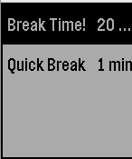

# feature-app-wakeup

This example shows how the [`Wakeup`](https://developer.getpebble.com/docs/c/group___wakeup.html) API works. 

This app is forked from the above linked app and has been tweaked to provide a 20 minute timer for screen break times.

## Icons Attribution
<a target="_blank" href="https://icons8.com/icon/8tRpLp4YwV5K/electronics">Electronics</a> icon by <a target="_blank" href="https://icons8.com">Icons8</a>
<a target="_blank" href="https://icons8.com/icon/dsCBk087BKif/old-computer">Old Computer</a> icon by <a target="_blank" href="https://icons8.com">Icons8</a>
https://icons8.com/icon/EwwBTzWtiitK/monitor